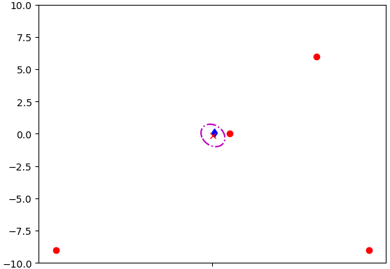

# 2D Localization Using EKF

The code is adapted from the matlab code in the class, and the course content can be viewed on <https://www.bilibili.com/video/BV1Z341147K9?p=12&vd_source=820cccaac77c148735a6f993eab65694>.

## Problem Statement

There are four beacons on the plane with known positions, while a robot moves on the plane at a constant velocity. The distance of the point from the four beacons can be measured at each moment, but the measurements contain noise. In this example, we use Extended Kalman Filter (EKF) to estimate the location of the robot in real time based on measurements.

## Model of the system

### Symbol Definition

$p_k$: robot position at time $k$.
$y_{k, i}$: distance measurement from beacon i at time k. $y_{k, i}=||b^{(i)} - p_k|| + v_i$, where $v_i$ is a noise.

### Equation

Let $x = \begin{bmatrix} p_k \\ \dot{p_k} \end{bmatrix}$, $y = \begin{bmatrix} y_{k, 1} \\ y_{k, 2} \\ y_{k, 3} \\ y_{k, 4} \end{bmatrix}$, the model of the system is as follows:

$$
\begin{equation}
\begin{aligned}
& x_{k+1} = \begin{bmatrix} I & I\Delta t \\ 0 & I \end{bmatrix}x_{k} \\
& y_k = h(x_k) + v_k, \: h_i(x_k) =  \sqrt{(x_{k, 1} - b_1^{(i)})^2 + (x_{k, 2} - b_2^{(i)})^2}
\end{aligned}
\end{equation}
$$

## Result

In the figure, the red dots are the beacons, and the blue diamond is the actual position of the robot. For the filtering result, the red fork is the mean value of the estimated position, and the purple ellipsoid is the confidence ellipsoid of the estimated position with confidence equal to 0.95.
